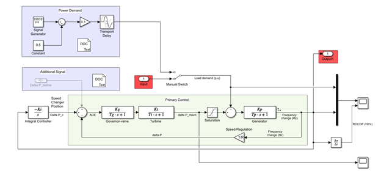
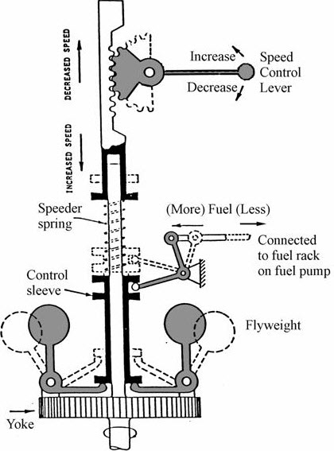
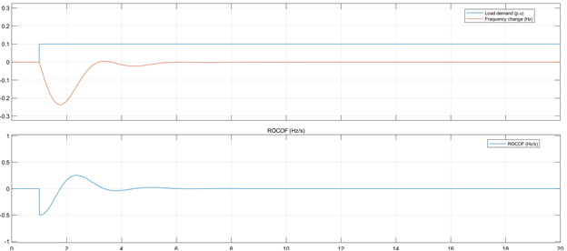
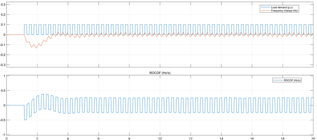
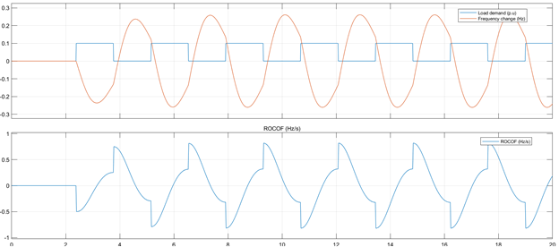
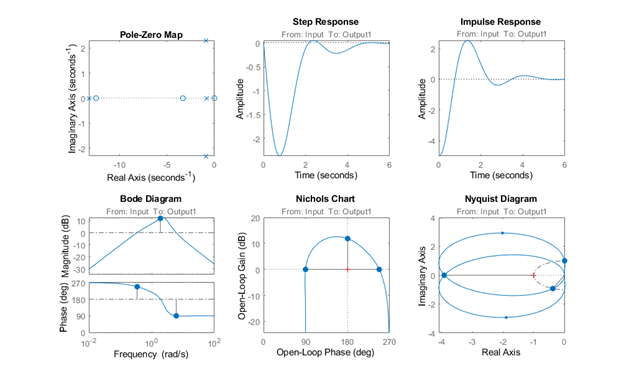

# LAMPA

<!-- Load amplification attack against power grids exploiting resonance characteristics of Load Frequency Control -->
*If you had control over a finite amount of electrical loads on a grid - say a botnet of internet connected coffee pots - what would be the best way to use them to cause a power blackout?*

 
     
    <em>Provided Single Area System</em>

More concisely, this repository includes simulations on load modulation strategies to optimize grid instability exploiting resonant behavior of Load Frequency Control (LFC) in modern power grids.

## Background on LFC

Most electricity produced comes from electromechanic AC generators (primarily driven by heat engines fueled by combustion or nuclear fission but also by other means such as the kinetic energy of flowing water). A fundamental trait of generators is that at constant input mechanical power, they rotate slower with larger loads and faster with smaller loads. The generated AC frequency is also directly proportional to the rotating speed of the machine. This is the enabling factor of the attack presented here.

Consider the case where load is applied: For any electromechanical device, the electromagnetic torque or force produced is directly proportional to the current flowing through them. If the load is increased, the armature current in the generator also increases. This armature current in turn produces a magnetic field that oposes that of the field magnet, increasing torque against the shaft, hence reducing speed (for constant input power).

It is crucial to mantain the frequency of the grid constant around 50 Hz (Europe) or 60 Hz (Americas and parts of Asia). Load Frequency Control is simply a system that adjusts the mechanical input power to the generator to match the electrical power demand and keep the rotational speed, and hence electrical frequency, nominal.

A good representation of what this system does is an old centrigufal "fly-ball" speed governor as shown on the left. Modern systems are electronic and may implement advanced control algorithms, but the principle is essentially the same. 

&nbsp;

&nbsp;

&nbsp;

## The attack

Knowing that load affects frequency, and that there is a system in place to keep the frequency nominal, the next question is what can we do to disturb that system. This is the response of the system when a load of 10% of its capacity is applied:

 

Switching the loads quickly (20rads/s) causes the following effect:

 

This is not only insignificant, but also operationally infeasible due to latencies. Watch what happens when the switching speed is 2.27rads/s (about 3.6 Hz or one cycle every ~2.8 seconds):

 

:smiley: 2.27 Rads/s happens to be the resonant frequency of the system. At this frequency, maximum rate of change of frequency (ROCOF) is equivalent to that caused by simply applying a load of 0.162 p.u. (16.2% of the plant capacity) - we have effectively amplified our load by 62% -, and prevented the system from return to nominal indefinetly. Absolute deviation, it's duration, and ROCOF, are all triggers to protection mechanisms that cut power to specific areas or shut down the grid completely to avoid damage.

The resonant frequency of the system can be be found by running the `LFC_linearized.m` script and looking at the peak frequency response in the Bode Diagram. The system parameters in the provided simulation are realistic, sourced from [here](https://www.researchgate.net/publication/222227238_AGC_for_autonomous_power_system_using_combined_intelligent_techniques
) and can be found in `LFC_parameters.m`, along with other useful calculations.

 
     
    <em>Stability Analysis plots generated by LFC_lineraized.m</em>

Instructions on running the simulation can be found in the Simulink model by opening the DOC blocks. The *Power Demand* area includes a signal generator to play with different waveforms. Firewall systems have been proposed to detect unusual patterns in load demand - with more classical cyber-attacks in mind -, however, if the attack involves real loads and not simple manipulation of sensor data, triggering firewall protections can be beneficial as LFC will not appropiately respond to the load demand. See also [DSM IoT](https://www.researchgate.net/publication/286119394_Achieving_demand_side_management_with_appliance_controller_devices).

&nbsp;

---

**mapez** - [telegram](https://t.me/mapezz)

